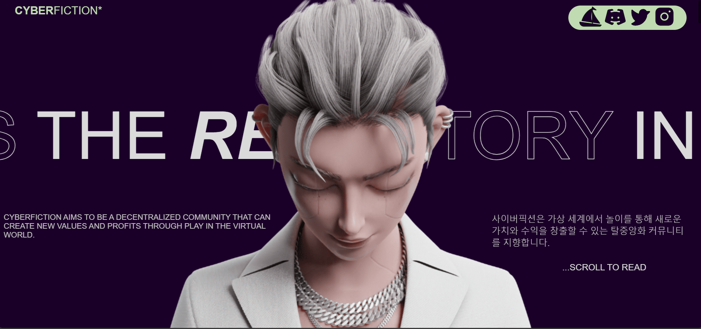

# CYBERFICTION-Clone

Welcome to the CyberFiction Clone project! This project is an interactive and immersive website inspired by CyberFiction, featuring captivating storytelling, stunning visuals, and dynamic user experiences. It's built using HTML, CSS, and JavaScript.

## Features

- **Immersive Storytelling:** Engage users with a futuristic narrative that unfolds as they make choices throughout the story.

- **Stunning Visuals:** Utilize visually appealing designs and background images to create a captivating environment.

- **Dynamic User Experiences:** Implement dynamic interactions using JavaScript to make the user experience seamless and engaging.

## Preview

## Technologies Used

- HTML
- CSS
- JavaScript
- GSAP (GreenSock Animation Platform)
- Locomotive Scroll

## License

This project is licensed under the [MIT License](LICENSE).

## Acknowledgments

- Inspiration: CyberFiction
- Background image: [Unsplash](https://unsplash.com)

